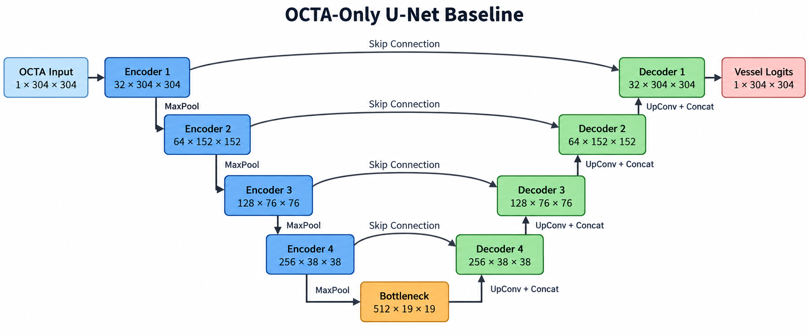

# OCTA-500 单模态血管分割 Baseline 实验总结

## 1. 实验概述

本实验对应研究路线的第一阶段，目标是建立一个结构清晰、训练稳定、可复现的 **OCTA-only 二值血管分割基线**，为后续 OCT + OCTA 多模态实验提供统一对照。

整体流程如下：

```text
OCTA(ILM_OPL) projection
          ↓
        U-Net
          ↓
Binary retinal vessel mask
```

本阶段不使用结构 OCT，不使用 artery/vein/FAZ 多任务，也不加入注意力、跨模态融合或拓扑损失。实验关注数据、训练、验证、测试和结果可视化流程是否可靠，以及标准 U-Net 在该任务上的可达到性能。

本次总结只使用正式训练目录 `runs/unet_3mm_ilm_opl` 中的结果，不使用开发阶段的一轮冒烟测试数据。

---

## 2. 运行环境

| 项目 | 配置 |
|---|---|
| Conda 环境 | `octa` |
| Python | 3.10.14 |
| PyTorch | 2.1.0+cu118 |
| CUDA Runtime | 11.8 |
| GPU | NVIDIA GeForce RTX 3090 |
| GPU 显存 | 24 GB |
| 混合精度 | 开启（FP16 autocast + GradScaler） |

TensorBoard 标量时间戳显示，从第 1 个 epoch 到第 77 个 epoch 的指标写入间隔约为 **112.8 秒（1.88 分钟）**。该时间不包含程序启动、最终测试、预测图保存等额外耗时，因此仅作为训练主体耗时的近似参考。

---

## 3. 任务定义

### 3.1 输入

本次实验使用 OCTA-500 的 3 mm 子集，输入为：

```text
data/OCTA-500数据集/3mm/OCTA(ILM_OPL)/xxxxx.bmp
```

`OCTA(ILM_OPL)` 是 ILM 到 OPL 范围内的二维 OCTA en-face 投影，能够较清楚地显示内层视网膜血管和 FAZ 结构。

输入属性：

| 属性 | 数值 |
|---|---|
| 图像格式 | BMP |
| 通道数 | 1（灰度） |
| 原始分辨率 | 304 × 304 |
| 原始像素范围 | 0–255 |
| 网络输入范围 | 0–1 |
| Tensor shape | `[B, 1, 304, 304]` |
| Resize/Crop | 无，保持原始分辨率 |
| 均值/标准差归一化 | 无，仅除以 255 |

### 3.2 Label 选择

本次实验的目标标签为：

```text
data/OCTA-500数据集/labels/GT_Capillary/xxxxx.bmp
```

训练参数中对应：

```text
--target GT_Capillary
```

标签读取后执行：

```python
mask = (mask > 0).float()
```

即：

```text
background = 0
vessel     = 1
```

虽然目录名为 `GT_Capillary`，但从本地标签的空间包含关系看，动脉、静脉和大血管标注基本都位于该标签的前景区域内。因此本实验将它作为完整二维视网膜血管网络的 binary vessel mask，而不是仅理解为不含大血管的“纯毛细血管”标签。

没有选择其他标签的原因：

- `GT_LargeVessel` 只覆盖大血管，不适合作为强调细血管的主任务标签；
- `GT_Artery` 和 `GT_Vein` 分别只包含单类血管；
- `GT_FAZ` 是无血管区标签；
- `GT_CAVF` 是 0–4 的组合多分类标签，不符合当前二值任务定义。

---

## 4. 数据划分

本实验采用固定的病例级顺序划分：

| 集合 | 病例编号 | 样本数 | 占比 |
|---|---:|---:|---:|
| Train | 10301–10440 | 140 | 70% |
| Validation | 10441–10450 | 10 | 5% |
| Test | 10451–10500 | 50 | 25% |
| 合计 | 10301–10500 | 200 | 100% |

划分单位为病例 ID，同一病例的输入和标签不会跨集合，因而不存在病例级数据泄漏。

本实验没有混入 6 mm 数据。3 mm 与 6 mm 图像分辨率和视野不同，后续应分别训练并分别报告结果，或设计明确的统一尺度策略。

---

## 5. 数据预处理与增强

### 5.1 预处理

输入图像处理：

```python
image = image.float() / 255.0
```

标签处理：

```python
mask = (mask > 0).float()
```

没有使用直方图均衡化、CLAHE、Gamma 校正、全局均值方差标准化或其他增强血管对比度的预处理。

### 5.2 训练增强

训练集对输入和标签同步执行：

- 随机旋转：`0° / 90° / 180° / 270°`；
- 随机水平翻转：概率 0.5；
- 随机垂直翻转：概率 0.5。

选择 90° 整数旋转可以避免对二值 mask 进行插值，不会额外改变血管宽度或产生非二值边缘。验证集和测试集不进行数据增强。

当前 baseline 没有使用任意角度旋转、随机裁剪、噪声、模糊、亮度/对比度变化和弹性形变。

---

## 6. 模型结构

模型为四层下采样的标准 U-Net，输入通道和输出通道均为 1。

### 6.1 网络结构图



图中下方 U 形路径表示主干特征流，上方弧线表示 U-Net 的 encoder–decoder 跳跃连接。每次下采样将空间尺寸减半并将通道数加倍；解码阶段逐级恢复空间分辨率，并与相同尺度的编码器特征拼接。

### 6.2 编码器

| 层级 | 通道数 | 操作 |
|---|---:|---|
| Input | 1 | 304 × 304 灰度图 |
| Encoder 1 | 32 | DoubleConv |
| Encoder 2 | 64 | MaxPool + DoubleConv |
| Encoder 3 | 128 | MaxPool + DoubleConv |
| Encoder 4 | 256 | MaxPool + DoubleConv |
| Bottleneck | 512 | MaxPool + DoubleConv |

每个 `DoubleConv` 为：

```text
3×3 Conv → BatchNorm → ReLU
3×3 Conv → BatchNorm → ReLU
```

### 6.3 解码器

每级解码器执行：

```text
2×2 Transposed Conv
          ↓
Concatenate encoder skip feature
          ↓
DoubleConv
```

最后使用 `1×1 Conv` 输出单通道 logits。模型内部不执行 Sigmoid；Sigmoid 只在 Dice Loss、指标计算和结果可视化时使用。

### 6.4 模型规模

| 项目 | 数值 |
|---|---:|
| Base channels | 32 |
| 可训练参数量 | 7,762,465 |
| 输入 shape | `[B, 1, 304, 304]` |
| 输出 shape | `[B, 1, 304, 304]` |

---

## 7. Loss 与优化设置

### 7.1 Loss

总损失为 BCE Loss 与 Dice Loss 的等权和：

\[
L=L_{BCE}+L_{Dice}
\]

BCE 使用数值稳定的 logits 版本：

\[
L_{BCE}=\operatorname{BCEWithLogits}(z,y)
\]

Dice Loss 定义为：

\[
L_{Dice}=1-\frac{2\sum_i p_i y_i+1}{\sum_i p_i+\sum_i y_i+1}
\]

其中平滑项为 1.0。Dice 先按单张图像计算，再在 batch 内取平均。

### 7.2 实际训练参数

| 参数 | 设置 |
|---|---:|
| 最大 epoch | 100 |
| 实际结束 epoch | 77 |
| Batch size | 8 |
| Optimizer | AdamW |
| 初始学习率 | 0.001 |
| Weight decay | 0.0001 |
| LR scheduler | ReduceLROnPlateau |
| Scheduler 监控量 | Validation Dice |
| LR 衰减系数 | 0.5 |
| LR patience | 5 epochs |
| Early-stopping patience | 20 epochs |
| 预测阈值 | 0.5 |
| DataLoader workers | 4 |
| Random seed | 42 |
| AMP | 开启 |
| Resume | 否，从头训练 |

学习率变化如下：

| 起始 epoch | 学习率 |
|---:|---:|
| 1 | 1.0000e-3 |
| 26 | 5.0000e-4 |
| 39 | 2.5000e-4 |
| 52 | 1.2500e-4 |
| 58 | 6.2500e-5 |
| 64 | 3.1250e-5 |
| 70 | 1.5625e-5 |
| 76 | 7.8125e-6 |

最佳 Validation Dice 出现在 epoch 57。此后连续 20 个 epoch 没有产生更高的 Validation Dice，因此在 epoch 77 触发早停。

---

## 8. 评价指标与模型选择

预测概率经过 Sigmoid 后，以阈值 0.5 二值化。

记录指标：

\[
Dice=\frac{2TP}{2TP+FP+FN}
\]

\[
IoU=\frac{TP}{TP+FP+FN}
\]

\[
Precision=\frac{TP}{TP+FP}
\]

\[
Recall=\frac{TP}{TP+FN}
\]

\[
Specificity=\frac{TN}{TN+FP}
\]

训练脚本报告的是在整个集合上累计 TP、FP、FN、TN 后得到的 pixel-level micro 指标，而不是逐图指标的算术平均。

模型选择规则：

```text
选择 Validation Dice 最高的 checkpoint
```

测试集不参与模型选择。训练结束后重新加载 `best.pt`，只对测试集执行最终评估。

---

## 9. 训练与验证结果

### 9.1 代表性 epoch

| Epoch | LR | Train Loss | Train Dice | Val Loss | Val Dice | Val IoU |
|---:|---:|---:|---:|---:|---:|---:|
| 1 | 1.000e-3 | 0.8099 | 0.7807 | 1.0004 | 0.8377 | 0.7207 |
| 5 | 1.000e-3 | 0.4693 | 0.8905 | 0.4451 | 0.8974 | 0.8139 |
| 10 | 1.000e-3 | 0.3916 | 0.8923 | 0.3800 | 0.8947 | 0.8094 |
| 20 | 1.000e-3 | 0.3542 | 0.8949 | 0.3419 | 0.9011 | 0.8201 |
| 30 | 5.000e-4 | 0.3442 | 0.8965 | 0.3368 | 0.9015 | 0.8206 |
| 40 | 2.500e-4 | 0.3430 | 0.8967 | 0.3340 | 0.9018 | 0.8212 |
| 50 | 2.500e-4 | 0.3397 | 0.8973 | 0.3309 | 0.9020 | 0.8215 |
| **57** | **1.250e-4** | **0.3403** | **0.8973** | **0.3309** | **0.9028** | **0.8228** |
| 66 | 3.125e-5 | 0.3390 | 0.8975 | **0.3294** | 0.9026 | 0.8225 |
| 77 | 7.813e-6 | 0.3380 | 0.8978 | 0.3300 | 0.9025 | 0.8223 |

### 9.2 最佳验证结果（epoch 57）

| 指标 | Train | Validation |
|---|---:|---:|
| Loss | 0.3403 | 0.3309 |
| Dice | 0.8973 | **0.9028** |
| IoU | 0.8138 | **0.8228** |
| Precision | 0.8837 | **0.8864** |
| Recall | 0.9114 | **0.9198** |
| Specificity | 0.9123 | **0.9083** |

最低 Validation Loss 出现在 epoch 66，为 0.3294；但模型选择依据是 Validation Dice，因此最终采用 epoch 57，而不是 epoch 66。

### 9.3 训练过程分析

- epoch 1 到 epoch 5 提升最明显，Validation Dice 从 0.8377 提升至 0.8974；
- epoch 20 后模型进入平台期，Validation Dice 基本稳定在 0.901–0.903；
- 多次降低学习率只带来较小的后期改善；
- 最佳 epoch 的 Train Dice 为 0.8973，Validation Dice 为 0.9028，两者没有出现明显背离；
- Validation 略高于 Train，与训练集启用了随机旋转/翻转增强、两集合难度差异及全局像素统计方式有关，不能简单解释为验证集泄漏；
- 最佳 epoch 后验证性能保持稳定，没有明显的灾难性过拟合，但继续训练也没有实质收益。

---

## 10. 正式测试结果

### 10.1 全测试集 micro 指标

最佳 epoch 57 在 50 个测试病例上的结果为：

| 指标 | 数值 | 百分比 |
|---|---:|---:|
| Loss | 0.3459 | — |
| Dice | **0.8953** | **89.53%** |
| IoU | **0.8104** | **81.04%** |
| Precision | **0.8728** | **87.28%** |
| Recall / Sensitivity | **0.9190** | **91.90%** |
| Specificity | **0.9043** | **90.43%** |

Validation Dice 与 Test Dice 的差值为：

```text
0.9028 - 0.8953 = 0.0075
```

即绝对下降约 0.75 个百分点，说明模型从验证集到测试集的性能变化较小。

Recall 高于 Precision（0.9190 vs 0.8728），表明模型整体更倾向于保留血管像素，代价是产生一定数量的假阳性。对于强调细小血管检出的任务，这种结果具有一定合理性，但后续仍需针对伪血管和背景噪声进行优化。

### 10.2 逐病例 macro 统计

以下数值为重新加载 `best.pt` 后，对 50 个测试病例逐张计算指标，再统计均值、样本标准差和中位数：

| 指标 | Mean | Std | Median |
|---|---:|---:|---:|
| Dice | 0.8941 | 0.0187 | 0.8960 |
| IoU | 0.8090 | 0.0295 | 0.8115 |
| Precision | 0.8719 | 0.0363 | 0.8803 |
| Recall | 0.9192 | 0.0243 | 0.9248 |
| Specificity | 0.9042 | 0.0227 | 0.9050 |

micro Dice 0.8953 与 macro Dice 0.8941 非常接近，说明总体结果没有被少数前景面积特别大的病例明显主导。

### 10.3 最佳与最差病例

Dice 最高的 5 个测试病例：

| Case | Dice | IoU | Precision | Recall | Specificity |
|---:|---:|---:|---:|---:|---:|
| 10472 | 0.9233 | 0.8576 | 0.9216 | 0.9250 | 0.9322 |
| 10485 | 0.9186 | 0.8495 | 0.9122 | 0.9251 | 0.9179 |
| 10477 | 0.9161 | 0.8452 | 0.9042 | 0.9283 | 0.9258 |
| 10474 | 0.9129 | 0.8397 | 0.9162 | 0.9096 | 0.9332 |
| 10493 | 0.9122 | 0.8386 | 0.9029 | 0.9217 | 0.9159 |

Dice 最低的 5 个测试病例：

| Case | Dice | IoU | Precision | Recall | Specificity |
|---:|---:|---:|---:|---:|---:|
| 10454 | 0.8037 | 0.6719 | 0.6965 | 0.9500 | 0.8874 |
| 10484 | 0.8595 | 0.7536 | 0.9081 | 0.8158 | 0.9486 |
| 10495 | 0.8661 | 0.7637 | 0.8077 | 0.9334 | 0.8534 |
| 10453 | 0.8709 | 0.7713 | 0.8887 | 0.8538 | 0.9218 |
| 10475 | 0.8730 | 0.7747 | 0.8250 | 0.9270 | 0.8800 |

最低性能病例呈现两类不同失败模式：

1. **过分割型**：如 10454，Recall 达到 0.9500，但 Precision 只有 0.6965，说明大量背景或异常信号被预测为血管；
2. **漏分割型**：如 10484，Precision 达到 0.9081，但 Recall 只有 0.8158，说明预测较保守，遗漏了部分血管。

---

## 11. 可视化结果

训练程序默认保存测试集前 8 个病例（10451–10458）的对比图，每行依次为：

```text
OCTA input | Ground truth | Probability map | Binary prediction
```


原始图片位置：`runs/unet_3mm_ilm_opl/test_predictions.png`，分辨率为 1864 × 3821。

### 11.1 图中 8 个病例的指标

| Case | Dice | IoU | Precision | Recall | Specificity |
|---:|---:|---:|---:|---:|---:|
| 10451 | 0.9005 | 0.8190 | 0.8833 | 0.9184 | 0.9010 |
| 10452 | 0.8995 | 0.8174 | 0.8810 | 0.9189 | 0.9090 |
| 10453 | 0.8709 | 0.7713 | 0.8887 | 0.8538 | 0.9218 |
| 10454 | 0.8037 | 0.6719 | 0.6965 | 0.9500 | 0.8874 |
| 10455 | 0.8852 | 0.7940 | 0.8532 | 0.9197 | 0.8834 |
| 10456 | 0.9115 | 0.8373 | 0.9049 | 0.9181 | 0.9242 |
| 10457 | 0.9058 | 0.8278 | 0.8827 | 0.9301 | 0.9147 |
| 10458 | 0.8811 | 0.7875 | 0.8373 | 0.9298 | 0.8884 |

### 11.2 视觉观察

- 在 10451、10452、10456 和 10457 中，预测能够较完整地恢复大血管与密集毛细血管网络，整体拓扑与 Ground Truth 接近；
- 中央 FAZ 区域基本保持为无血管区域，没有被大面积填充；
- 模型对细小血管的检出倾向较强，与测试集 Recall 高于 Precision 的数值结果一致；
- 10453 的主要问题是部分细血管漏检，对应较低的 Recall 0.8538；
- 10454 是最明显的失败案例。该病例 Ground Truth 的血管分布与普通病例差异较大，模型产生大量额外血管预测，形成高 Recall、低 Precision 的典型过分割；
- 10455 和 10458 也存在一定假阳性，表现为预测网络比 Ground Truth 更密集；
- 概率图整体具有较清晰的血管响应，但固定阈值 0.5 仍无法同时解决所有病例的过分割和漏分割。

更详细的 TP、FP、FN 误差图及标签/预测轮廓叠加可通过以下 Notebook 交互查看：

- `结果与标签可视化.ipynb`

---

## 12. 实验产物

实验目录：`runs/unet_3mm_ilm_opl/`

| 文件 | 内容 |
|---|---|
| `config.json` | 本次实际训练参数 |
| `history.csv` | 77 个 epoch 的训练/验证指标与学习率 |
| `best.pt` | epoch 57 的最佳 Validation Dice checkpoint，约 88.9 MiB |
| `last.pt` | epoch 77 早停时的最后 checkpoint，约 88.9 MiB |
| `test_metrics.json` | 最佳模型的正式测试集 micro 指标 |
| `test_predictions.png` | 前 8 个测试病例的输入、标签、概率和预测对比 |
| `tensorboard/` | Loss、Dice、IoU、Precision、Recall、Specificity 和学习率日志 |

查看 TensorBoard：

```bash
conda activate octa
tensorboard --logdir /root/workplace/octa_baseline/runs
```

交互式可视化：

```text
/root/workplace/octa_baseline/结果与标签可视化.ipynb
```

---

## 13. 复现实验命令

```bash
conda activate octa
cd /root/workplace/octa_baseline

python train.py \
  --data-root ../data/OCTA-500数据集 \
  --scan-size 3mm \
  --projection 'OCTA(ILM_OPL)' \
  --target GT_Capillary \
  --epochs 100 \
  --batch-size 8 \
  --workers 4 \
  --learning-rate 0.001 \
  --weight-decay 0.0001 \
  --base-channels 32 \
  --threshold 0.5 \
  --patience 20 \
  --seed 42 \
  --amp \
  --output-dir runs/unet_3mm_ilm_opl
```

---

## 14. 当前实验的局限性

1. **只有一次固定划分、单个随机种子**：当前结果尚不能反映跨种子的统计波动；
2. **只评估 3 mm 子集**：还没有完成 6 mm 独立实验；
3. **只使用 OCTA(ILM_OPL)**：尚未比较 FULL、ILM_OPL 和 OPL_BM 投影；
4. **只使用标准 U-Net**：还没有加入 UNet++ 或其他 backbone 对照；
5. **没有拓扑指标**：当前没有 clDice、连通分支数、断裂率等血管结构指标；
6. **没有血管尺度分层分析**：未分别统计大血管与小血管性能；
7. **固定阈值 0.5**：没有在验证集上独立校准阈值；
8. **增强策略较基础**：尚未研究强度增强、噪声鲁棒性或随机尺度变化；
9. **标签语义需要谨慎表述**：`GT_Capillary` 在本实现中作为完整 vessel mask 使用，论文中应明确这一处理；
10. **可复现性不是逐 bit 确定性**：虽然设置了随机种子，但没有强制 CUDA deterministic algorithms；
11. **尚未引入 OCT**：当前结果只代表单模态 baseline，不能用于判断 OCT 是否带来增益。

---

## 15. 结论

本次 OCTA-only U-Net baseline 已完成数据读取、增强、训练、验证、早停、测试、指标记录和可视化的完整闭环。

核心结果为：

```text
Best validation epoch: 57
Validation Dice:        0.9028
Test Dice:              0.8953
Test IoU:               0.8104
Test Precision:         0.8728
Test Recall:            0.9190
Test Specificity:       0.9043
```

模型能够较稳定地恢复大多数病例的主干和毛细血管网络，且验证到测试的 Dice 仅下降约 0.75 个百分点。主要问题是不同病例间的假阳性/假阴性模式差异明显，尤其是异常血管分布病例可能发生严重过分割。

因此，该结果可以作为下一阶段 OCT + OCTA early-fusion 实验的有效对照。后续多模态实验应保持相同的数据划分、预处理、U-Net 容量、Loss、训练轮数、模型选择规则和指标实现，只改变输入模态或融合方式，才能公平判断结构 OCT 是否带来真实增益。
