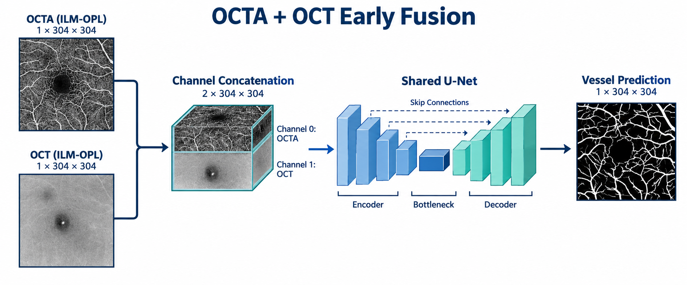

# OCTA + OCT 简单多模态融合实验

九组正式实验的指标与分析见 [OCTA、OCT 与 Early Fusion 三组对照实验总结](OCTA_OCT三组对照实验总结.md)。

本目录保存第二阶段实验。目标是检验同病例的结构 OCT 投影能否改善 OCTA 血管分割。复用相邻 `octa_baseline/octa` 的模型、损失、训练引擎和指标实现，因此两个目录需要一起保留；使用已有 Conda 环境 `octa`。

## 实验设计

采用 early fusion：将 OCTA 和 OCT 的灰度投影沿通道拼接，输入同一个 U-Net。



```text
OCTA(ILM_OPL) [B,1,304,304] ─┐
                            ├─ concat → [B,2,304,304] → U-Net → [B,1,304,304]
OCT(ILM_OPL)  [B,1,304,304] ─┘
```

两个输入共同进入第一个卷积层，后续编码器、解码器和单模态版本一致。第一层从 1 通道变成 2 通道，base=32 时增加 288 个卷积权重；其余结构相同。模型从头训练，不加载单模态权重。

| 实验 | 输入 | 参数 mode | 用途 |
|---|---|---|---|
| A | OCTA | octa | 对照单模态基线 |
| B | OCT | oct | 评估结构 OCT 单独提供的信息 |
| C | OCTA + OCT | fusion | 检验简单拼接的增益 |

主实验固定 `GT_Capillary`；随后可对 `GT_Artery`、`GT_Vein` 分别重复上述对照。三个标签是独立的二分类任务，不能将不同标签的分数差当作融合收益。`GT_Capillary` 的精确语义仍需结合官方标注说明确认。

## 固定设置

沿用已完成的 3 mm baseline：Train 10301–10440（140 例），Validation 10441–10450（10 例），Test 10451–10500（50 例）。以病例编号匹配投影与标签。默认 OCT 和 OCTA 均选择 ILM_OPL；相同病例和尺寸并不能证明解剖配准准确，需要检查配对预览图。

图像分别除以 255，标签 `>0` 二值化，不额外加入 CLAHE 或标准化。训练时先拼接两模态，再对拼接图和标签共同旋转/翻转，确保几何增强同步。验证和测试不增强。即使是单模态对照，也检查所有配对文件，保证三组使用同一批病例。

| 参数 | 设置 |
|---|---|
| 网络 | 四级 U-Net，base_channels=32 |
| 损失 | BCEWithLogits + Soft Dice，权重 1:1，smooth=1 |
| 优化器 | AdamW |
| 学习率 / weight decay | 0.001 / 0.0001 |
| Batch size / workers | 8 / 4 |
| 最大 epoch / 早停耐心 | 100 / 20 |
| Scheduler | 验证 Dice，factor=0.5，patience=5 |
| 阈值 / seed | 0.5 / 42 |
| AMP | CUDA 时默认启用 |
| 最优 checkpoint | 验证集 Dice 最大 |
| 指标 | 全数据集 micro Dice、IoU、Precision、Recall、Specificity |

训练历史的 learning_rate 记录当轮实际使用的学习率。损失按样本数量加权平均；Soft Dice 损失是样本级计算再取平均，和用于报告的全局 micro Dice 不是同一聚合方式。

## 运行

所有命令从 `/root/workplace` 执行。脚本的默认数据和输出路径以脚本位置定位。

```bash
conda activate octa

# 先检查所有病例文件、尺寸和值域，并生成前四个训练病例的并排图
python octa_oct_fusion/train.py --check-data \
  --output-dir octa_oct_fusion/runs/pair_check

# OCTA-only 控制实验（也可以先参考原有 baseline 的结果）
python octa_oct_fusion/train.py --mode octa

# OCT-only 控制实验
python octa_oct_fusion/train.py --mode oct

# 主实验：OCTA + OCT
python octa_oct_fusion/train.py --mode fusion

# 动脉和静脉扩展
python octa_oct_fusion/train.py --mode fusion --target GT_Artery
python octa_oct_fusion/train.py --mode fusion --target GT_Vein

# 大血管扩展
python octa_oct_fusion/train.py --mode fusion --target GT_LargeVessel
```

默认输出目录带有模态、扫描范围、slab、标签和 seed，例如 `runs/fusion_3mm_ILM_OPL_GT_Capillary_seed42`。已有非空目录会拒绝写入；重复实验请指定新的 `--output-dir`。

默认训练结束后，只用最佳验证 checkpoint 评估一次测试集。调试可以用 `--epochs 1 --skip-test --output-dir ...`，仅生成验证预测图。当前独立入口支持保存训练状态，尚未提供恢复训练命令或 TensorBoard；曲线数据保存在 `history.csv`。

## 输出与可视化

正式实验保存 `config.json`（含病例清单、输入通道顺序和参数量）、`history.csv`、`best.pt`、`last.pt`、`test_metrics.json`、`test_predictions.png`。图像文字均为英文。

预测图按行展示同一病例，六列依次是 OCTA、OCT、标签、概率、二值预测、误差图。误差图绿色为 TP、红色为 FP、蓝色为 FN、黑色为 TN。无论哪种 mode，图中都显示两个原始模态，但模型输入仅由 mode 决定。

## 判定标准与结果表

首要指标为测试集 Dice，其次为 IoU、Precision 和 Recall；关注细血管断裂是否减少、是否增加假阳性。验证集用于选择模型和实验方案，不能按测试集分数不断调参。若差异较小，增加预先确定的种子 42/43/44，三种模式分别训练并报告均值±标准差；单次训练不支持统计显著性结论。

| 3 mm / GT_Capillary | Dice | IoU | Precision | Recall | Specificity |
|---|---:|---:|---:|---:|---:|
| 既有 OCTA-only U-Net | 0.8953 | 0.8104 | 0.8728 | 0.9190 | 0.9043 |
| 本入口 OCTA-only 控制 | 待训练 | — | — | — | — |
| OCT-only | 待训练 | — | — | — | — |
| OCTA + OCT early fusion | 待训练 | — | — | — | — |

若融合未提升，先检查空间对齐、OCT 对比度与表示方式，并比较训练/验证曲线；再考虑不同 OCT slab 或双编码器。当前实验使用 2D en-face 投影，没有使用原始 3D OCT 体积。

## 文件职责

- `data.py`：按病例配对读取、尺寸验证、模态选择与同步增强。
- `train.py`：配对检查、三组对照训练、checkpoint、评估及六列可视化。
- `tests/test_fusion.py`：检查通道顺序、增强一致性和双通道反向传播。
- `runs/`：检查输出、调试结果与正式实验结果，彼此使用独立目录。

阶段状态：已提供实验设计和实现。数据检查、测试和 smoke 验证记录见 `验证记录.md`；正式 100 epoch 多模态实验需另行运行，不能把 smoke 结果作为最终实验指标。
