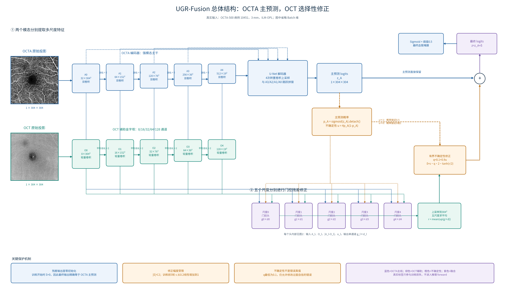
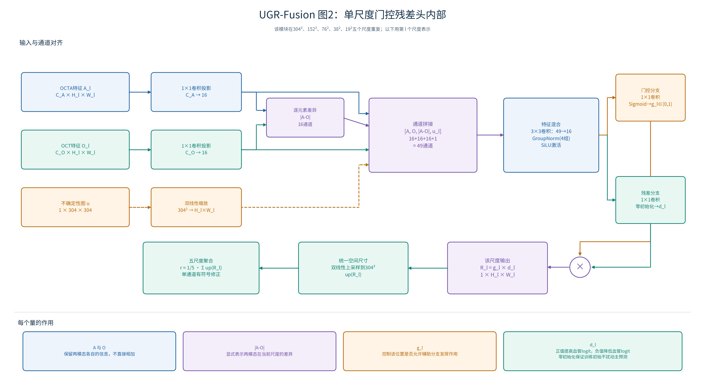
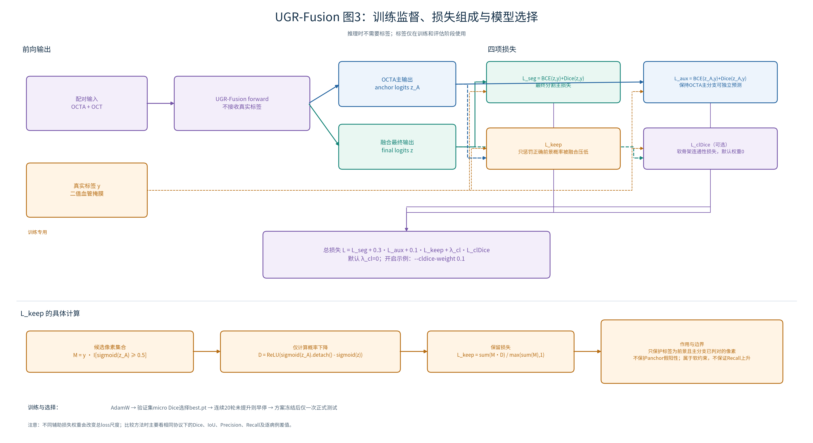
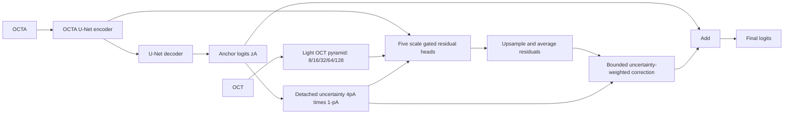

# UGR-Fusion：OCTA 主导的不确定性引导残差融合

本目录为第三阶段实验：根据 early fusion 的微小增益与 Recall 下降，提出可检验的 OCT 辅助修正方案。UGR 是本项目的工作名称（Uncertainty-Guided Residual Fusion），不代表已有论文模型或已证明的新颖方法。

使用既有 `octa` 环境，依赖相邻的 `octa_baseline` 与 `octa_oct_fusion/data.py`，不需下载预训练权重。默认从头训练。正式模型效果尚未验证，不承诺提升。

## 1. 现有结果如何指导设计

三类标签在 early fusion 后 Precision 上升、Recall 下降，而 Dice 只增加约 0.0001–0.0011。OCT-only 静脉还出现全背景预测。这说明需要检验一种非对称方案：以强模态 OCTA 保持血管主预测，让 OCT 学习有条件的修正，而不是一开始就平等混合。

这些指标不能证明 OCT 没有信息，也不能单独定位失败机制。这里的设计是研究假设，后续由对照和验证集证据判断。

## 2. 论文依据与本项目改动

| 原始论文 | 可借鉴思路 | 本项目中的区别 |
|---|---|---|
| [TokenFusion，CVPR 2022](https://openaccess.thecvf.com/content/CVPR2022/html/Wang_Multimodal_Token_Fusion_for_Vision_Transformers_CVPR_2022_paper.html) | 选择跨模态信息，而非无条件混合 | 不使用 Transformer token 替换；在五级 CNN 特征上学习 OCT 修正门控 |
| [Gated Fully Fusion，AAAI 2020](https://ojs.aaai.org/index.php/AAAI/article/view/6805) | 门控选择多层特征 | 门控只负责辅助分支贡献，保留 OCTA 独立主预测 |
| [clDice，CVPR 2021](https://openaccess.thecvf.com/content/CVPR2021/html/Shit_clDice_-_A_Novel_Topology-Preserving_Loss_Function_for_Tubular_Structure_CVPR_2021_paper.html) | 通过骨架重叠监督管状结构连通性 | 作为可选损失消融，默认不开启；不把 clDice 算作自有创新 |

clDice 实现依据上述论文的软形态学定义，并参考[作者仓库](https://github.com/jocpae/clDice)的运算语义。此处为单通道前景、逐样本求值；没有去掉 channel 0。训练中的 soft-clDice 不是二值骨架评价指标。

本项目拟研究的组合是：**OCTA 主预测 + 多尺度 OCT 门控修正 + 不确定性限制修正位置 + 真阳性保留约束**。不确定性、残差和门控各自都是已有技术；组合在本任务上的价值需要消融证明。当前检索不是完整新颖性查重，不能宣称“首次”或已经达到顶会创新标准。

## 3. 结构与公式

### 3.1 中文总体结构图



[高清 PNG](assets/中文结构图/UGR_图1_总体结构_中文.png) · [论文 PDF](assets/中文结构图/UGR_图1_总体结构_中文.pdf) · [可缩放 SVG](assets/中文结构图/UGR_图1_总体结构_中文.svg)

左侧为病例10451的真实 OCTA/OCT ILM-OPL 投影，灰度像素保持不变。蓝色路径产生 OCTA 主预测；绿色路径提取 OCT 五尺度辅助特征；橙色路径计算预测不确定性并限制修正幅度；紫色表示融合结果。图中同时标出了五个尺度、通道数、空间尺寸、跳跃连接、残差聚合和有界 logit 修正。

### 3.2 单尺度门控残差头详图



[高清 PNG](assets/中文结构图/UGR_图2_门控残差头_中文.png) · [论文 PDF](assets/中文结构图/UGR_图2_门控残差头_中文.pdf) · [可缩放 SVG](assets/中文结构图/UGR_图2_门控残差头_中文.svg)

该图展开 `RefineScale`：OCTA和OCT特征分别经1×1卷积变为16通道，加入绝对差 `|A-O|` 与缩放后的不确定性，得到49通道拼接特征；3×3卷积、GroupNorm和SiLU融合后，分成门控 `g_l` 与有符号残差 `d_l` 两支。两者相乘、上采样并跨尺度平均。

### 3.3 训练损失与模型选择图



[高清 PNG](assets/中文结构图/UGR_图3_训练损失_中文.png) · [论文 PDF](assets/中文结构图/UGR_图3_训练损失_中文.pdf) · [可缩放 SVG](assets/中文结构图/UGR_图3_训练损失_中文.svg)

该图区分推理输出与训练监督，展开最终分割损失、OCTA anchor辅助损失、真阳性保留损失和可选soft-clDice。标签只进入损失，不进入模型forward。`L_keep`只约束标签为前景且anchor已经判对的像素；它不保护anchor假阳性，也不保证Recall一定提高。

三张图与 `model.py`、`losses.py` 的默认实现一致。不确定性 `u=4p_A(1-p_A)` 是预测模糊程度的启发式，不是经过校准的错误概率。运行 `python octa_ugr_fusion/draw_architecture_cn.py` 可重画，使用 `--case-id` 切换真实病例。旧英文合并图仍保存在 `assets/ugr_fusion_architecture.*`。



1. OCTA 编码器为原始 U-Net 的 32/64/128/256/512 通道；解码器只运行一次，产生 anchor logits `zA`。
2. OCT 辅助金字塔为 8/16/32/64/128 通道，采用普通卷积和深度卷积、GroupNorm、SiLU。
3. 每个尺度把 OCTA 和 OCT 特征投影到 16 通道，拼接两者、绝对差与下采样的不确定性，产生一个空间门控和一个有符号残差。
4. 五个尺度的门控残差上采样到原分辨率并平均，再加到 anchor logits 上。它属于多尺度特征条件下的 **logit 残差修正**，没有在编码器中直接相加融合特征，也不是双完整 U-Net。

设 `pA = sigmoid(zA).detach()`，`u = 4 pA (1-pA)`，平均修正为 `r`：

```text
q = 0.1 + 0.9 u
delta = strength × q × 2 × tanh(r / 2)
zFinal = zA + delta
```

`u` 只是预测模糊程度的启发式指标，不是经过校准的 epistemic uncertainty。0.1 的下限允许模型修改过度自信的错误。修正上限为 2 个 logit 单位，默认训练前 5 轮线性增加 strength；验证与推理始终使用 strength=1。

残差输出层零初始化，使初始预测精确等于同一模型内的 OCTA anchor。第一步主要学习残差输出层，之后梯度进入 OCT 分支和门控。它不等于加载已训练 baseline，也不保证训练后不会产生负增益。

## 4. 损失

```text
L = BCE+Dice(final)
  + 0.3 × BCE+Dice(anchor)
  + 0.1 × L_keep
  + lambda_cl × soft-clDice(final)
```

`L_keep` 只在训练标签为前景且 anchor 概率 >=0.5 的像素计算 `max(pA.detach()-pFinal, 0)` 的平均值。目的在于减少融合修正对已有真阳性的抑制，不强迫保留 anchor 的假阳性。验证计算损失时使用标签，但 forward 完全不接收标签。它是软约束，不能保证 Recall 不下降。

默认 `lambda_cl=0`，先验证融合策略；第二步用 `--cldice-weight 0.1` 单独比较。该值是预设待验证超参数，不是已调优值。比较模型时主要看 Dice/IoU/Precision/Recall，`seg_loss` 可比较，而加入不同辅助项后的总 loss 不能直接排名。

## 5. 固定实验协议

3 mm / ILM_OPL，Train 140（10301–10440）、Val 10（10441–10450）、Test 50（10451–10500）。相同 `/255` 归一化和配对几何增强，BCE+Dice 主损失。默认 AdamW lr=0.001、wd=0.0001、batch=8、workers=4、100轮、patience=20、阈值0.5、AMP、seed42。验证 Dice 选择 best.pt。

采用独立 DataLoader 随机生成器，使样本顺序不受不同模型初始化消耗随机数的影响。仍不保证 GPU 位级可复现。新入口对照与历史入口的随机数消费不同，因此历史九组结果为参考；严谨比较应在此入口重新跑 matched controls。

研究阶段使用 `--skip-test`，只评估验证集。协议冻结后去掉该参数进行最终训练/测试。不得反复根据已观察的测试表现选择超参数；已有测试集被查看多次这一限制应在报告中说明。

## 6. 运行命令

从项目根目录运行：

```bash
cd /root/workplace
conda activate octa

# 首轮：毛细血管；开发阶段只看验证集
python octa_ugr_fusion/train.py --target GT_Capillary --skip-test

# 动脉、静脉
python octa_ugr_fusion/train.py --target GT_Artery --skip-test
python octa_ugr_fusion/train.py --target GT_Vein --skip-test

# 大血管
python octa_ugr_fusion/train.py --target GT_LargeVessel --skip-test

# 同一入口的单 OCTA / early fusion 对照
python octa_ugr_fusion/train.py --model octa --target GT_Capillary --skip-test
python octa_ugr_fusion/train.py --model early --target GT_Capillary --skip-test
```

大血管建议完成同入口的三组 matched controls，以区分新模型增益和不同训练随机过程：

```bash
# OCTA-only
python octa_ugr_fusion/train.py --model octa --target GT_LargeVessel --skip-test

# 原始输入级融合
python octa_ugr_fusion/train.py --model early --target GT_LargeVessel --skip-test

# UGR-Fusion
python octa_ugr_fusion/train.py --model ugr --target GT_LargeVessel --skip-test
```

三组默认分别保存到 `runs/octa_GT_LargeVessel_seed42`、`runs/early_GT_LargeVessel_seed42` 和 `runs/ugr_GT_LargeVessel_seed42`。`GT_LargeVessel` 按数据集提供的二值 BMP 独立训练；代码不把它现场计算为 `GT_Artery ∪ GT_Vein`。研究阶段保留 `--skip-test`，先根据验证集冻结方案，再运行不带该参数的正式测试。

默认目录 `runs/ugr_GT_Capillary_seed42`，重复实验必须指定新的 `--output-dir`。不自动覆盖结果。目前没有 resume 参数，修改 epoch 后是重新训练。

已提供可选拓扑损失与关键消融：

```bash
# 有效参数量相同，辅助分支也读取 OCTA：检验额外容量是否解释收益
python octa_ugr_fusion/train.py --aux-source octa --skip-test \
  --output-dir octa_ugr_fusion/runs/capillary_capacity_control

# 不使用不确定性，所有位置允许相同修正幅度
python octa_ugr_fusion/train.py --no-uncertainty --skip-test \
  --output-dir octa_ugr_fusion/runs/capillary_no_uncertainty

# 不使用门控（g=1）
python octa_ugr_fusion/train.py --no-gate --skip-test \
  --output-dir octa_ugr_fusion/runs/capillary_no_gate

# 不使用真阳性保留约束
python octa_ugr_fusion/train.py --retention-weight 0 --skip-test \
  --output-dir octa_ugr_fusion/runs/capillary_no_retention

# 在完整方法上增加 clDice（也要给 early 对照加同样损失）
python octa_ugr_fusion/train.py --cldice-weight 0.1 --skip-test \
  --output-dir octa_ugr_fusion/runs/capillary_with_cldice
python octa_ugr_fusion/train.py --model early --cldice-weight 0.1 --skip-test \
  --output-dir octa_ugr_fusion/runs/early_with_cldice
```

第一轮优先完成 OCTA / early / UGR / capacity-control 四组；验证集上若没有收益，先分析再决定是否扩大实验。确定方案后对 seed42/43/44 重复相同对照，不能只报告最好 seed。

## 7. 推理消融和可解释输出

```bash
python octa_ugr_fusion/evaluate.py \
  --run-dir octa_ugr_fusion/runs/ugr_GT_Capillary_seed42 \
  --split val --output-dir octa_ugr_fusion/runs/capillary_val_ablation
```

默认在验证集比较正常 OCT、全零 OCT、三次无自身匹配的打乱 OCT，并保存逐病例 CSV。确认协议后可以指定 `--split test`。目前只支持本目录 checkpoint。

置零后的性能下降可能来自分布偏移；打乱后下降表明配对信息有影响，但不能单独证明 OCT 提供了相对 OCTA-only 的净增益。需要结合容量控制与多 seed 对照。门控亮度也不等同于因果解释，应同时观察 `correction_abs` 与误差图。

训练自动保存八列图：OCTA、OCT、标签、anchor 概率、最终预测、误差、平均 gate、有符号 logit correction。图片使用英文。更多概率/轮廓交互可后续添加 Notebook，旧 Notebook 不能直接加载新模型结构。

## 8. 保存内容与验收标准

- config.json：所有参数、病例划分、参数量和环境；history.csv：训练/验证指标与各损失分量、gate 均值、修正强度。
- best.pt / last.pt：模型与优化器状态；val_metrics.json 或 test_metrics.json：最佳模型评估。
- val_predictions.png 或 test_predictions.png：预测和融合解释图。
- evaluate.py：micro 指标及逐病例 CSV，可进一步做配对统计。

验收标准：同标签下，UGR 应相对同入口 OCTA 与 early 在多个 seed 上稳定改善 Dice/IoU，同时检查 Recall 是否恢复；若加入 clDice，还应另行实现并报告二值骨架 clDice 指标，目前仅提供 soft-clDice 训练损失。没有达到这些条件前，不宣称改进有效。

验证详情见 `验证记录.md`。现阶段只进行代码测试和一轮真实数据 smoke，不把 smoke 指标当作正式研究结果。
